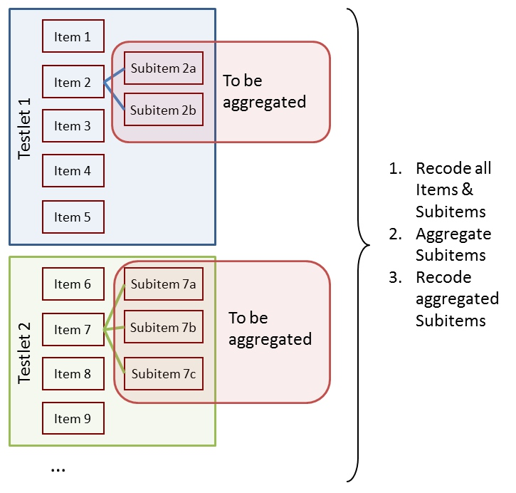
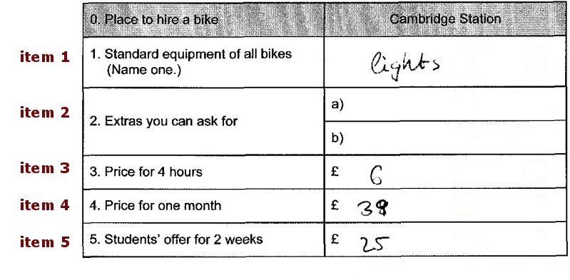
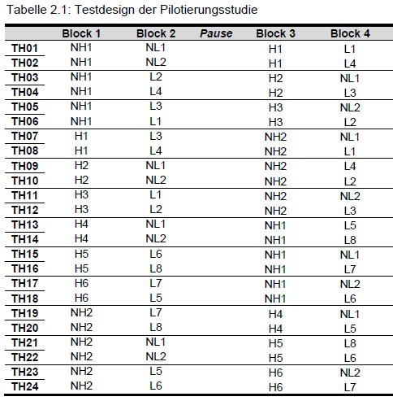

# Getting Started

## Installation

`eatPrep` is on GitHub. You can install R packages from GitHub via the
`remotes` package. With the following code you can download both
packages `remotes` and `eatPrep`.

``` r

#install.packages("remotes")
#remotes::install_github("https://github.com/sachseka/eatPrep")
library(eatPrep)
#> Loading required package: readxl
```

## Introduction

The goal of `eatPrep`, short for
`Educational Assesment Tools: Preparation`, is to automate the
preparation of item response test data; especially but not exclusively
for typical use cases at the *Institute for Educational Quality
Improvement* (IQB). Therefore it works together with IQB-specific
applications such as the `ItemDB` or `ZKDaemon`.

### Paper Competence Data Preparation

We usually give students paper tests or questionnaires that they fill
out by hand, while being supervised. The results are later collected
centrally. These tests are then scanned. For multiple choice questions
or tick questions an optic scanning system is used that recognizes
marked fields automatically and transmits them to a digital data bank.
Trained coders evaluate the (partially) open questions. This data is
usually in a SPSS (.sav) format.

We use `eatPrep` for the standardization and automation of the handling
of such data.

### Features

The main purpose of `eatPrep` is to read, score, aggregate and merge
data from a regular `SPSS` (`.sav`) data file (via the function
[`readSpss()`](https://sachseka.github.io/eatPrep/reference/readSpss.md))
and meta data from databases
([`readDaemonXlsx()`](https://sachseka.github.io/eatPrep/reference/readDaemonXlsx.md))
and Excel spreadsheets
([`readMerkmalXlsx()`](https://sachseka.github.io/eatPrep/reference/readMerkmalXlsx.md)).
Additional functions include checking the data
([`checkData()`](https://sachseka.github.io/eatPrep/reference/checkData.md)),
meta data
([`checkInputList()`](https://sachseka.github.io/eatPrep/reference/checkInputList.md)),
and the design
([`checkDesign()`](https://sachseka.github.io/eatPrep/reference/checkDesign.md)),
recoding of (missing) values
([`recodeData()`](https://sachseka.github.io/eatPrep/reference/recodeData.md),
[`mnrCoding()`](https://sachseka.github.io/eatPrep/reference/mnrCoding.md),
[`aggregateData()`](https://sachseka.github.io/eatPrep/reference/aggregateData.md),
[`scoreData()`](https://sachseka.github.io/eatPrep/reference/scoreData.md),[`collapseMissings()`](https://sachseka.github.io/eatPrep/reference/collapseMissings.md)),
working with rater data
([`meanAgree()`](https://sachseka.github.io/eatPrep/reference/meanAgree.md),
[`meanKappa()`](https://sachseka.github.io/eatPrep/reference/meanKappa.md)),
evaluating item categories
([`catPbc()`](https://sachseka.github.io/eatPrep/reference/cat.pbc.md),
[`evalPbc()`](https://sachseka.github.io/eatPrep/reference/evalPbc.md))
and exporting prepared or raw item data sets to different formats
([`writeSpss()`](https://sachseka.github.io/eatPrep/reference/writeSpss.md),
[`prep2GADS()`](https://sachseka.github.io/eatPrep/reference/prep2gads.md)).
Most of this can be done with a single function call to
[`automateDataPreparation()`](https://sachseka.github.io/eatPrep/reference/automateDataPreparation.md).

|  |
|----|
| **Automation** of Data Preparation |
| Various **tests**, plausibility checks and diagnostics |
| Handling of many different **missing types**, if desired retention until the end (incl. missing-not-reached calculation) |
| Additional **tools** (category separation, rater functions, semi-manual data cleansing, export functions…) |

## Data Structures of Paper Competency Data at the IQB

In a prototypical scenario, we are constructing a test at the IQB,
e.g. for educational purposes. For our pilot study, we have created
several overlapping booklets and a variety of items with different item
formats (constructed response, multiple choice).  
Thereby, the data consists of several layers:

|  |  |
|----|----|
| **booklets** | containing blocks |
| **blocks/cluster** | containing tasks |
| **tasks** | contain units (=items) (usually for a common stimulus/testlet) |
| **units** | containing subunits/subitems |
| **subunits** | having values |
| **values** | including missings and recode values |
| **valueRecodes** | also “Scores”: A mapping of the original values to a smaller number of categories (usually at least True/False/Missing, i.e. 1/0/NA) that are better suited for IRT scaling |

**The goal is to**:

1.  Recode all items and subitems
2.  Aggregate subitems
3.  Recode aggregated subitems



| Subitems, Items and Tasks | Subitems, Items, Tasks, Values and Scores |
|----|----|
|  |  |

| Tasks in blocks and blocks in booklets                     |
|------------------------------------------------------------|
|  |

### Missing Values

Now we would like to prepare the data collected in this way for scaling.
In doing so, we would like to know if the booklets are speeded (number
of mnr). Additionally, we intend to use different missing treatments for
the actual scaling, so we preserve missing values during data
preparation and recode them right before scaling the data. `eatPrep` can
help us with all of that.

Here is an overview for different value types the IQB uses:

| Code | Label | Abbr | Explanation |
|:---|:---|:---|:---|
| -98 | mir | missing invalid response | \(1\) Item was edited, and (2a) empty answer or (2b) invalid (joke) answer. |
| -99 | mbo | missing by omission | Item wasn’t edited but seen, or wasn’t seen, but there are seen or edited subsequent Items. |
| -96 | mnr | missing not reached | \(1\) Item wasn’t seen, and (2) all subsequent Items weren’t seen, either. |
| -97 | mci | missing coding impossible | \(1\) Item should/could have been edited, and (2) answer can’t be analysed due to technical problems. |
| -94 | mbd | missing by design | no answer, because Item wasn’t shown to the testperson by design. |

**Missing Types** {.table}

#### Representation of the Data Structure in eatPrep

Now, how are booklets, blocks, tasks, items, subitems, values and scores
stored in eatPrep?

- analogous to a simple relational meta database: a list of several data
  frames with a predefined structure and fixed names
- we need meta data about the items

Information/meta data about items is stored in many different ways,
e.g., databases, Excel sheets, sometimes even in item names. `eatPrep`
requires this meta data to have a specific form, namely a series of
relational tables. For `eatPrep` it is most convenient to store these
tables in a list. When downloading the `eatPrep` package, you can find
files with some example tables in the `data` folder.

Sheets have specific names, also the columns in those sheets have
specific names.

`inputMinimal` contains the bare minimum for all functions in `eatPrep`
to work, `inputList` contains additional meta data about the items (such
as information about the task’s content).

``` r

# Example: inputMinimal
inputMinimal <- list(units = inputList$units[ -nrow(inputList$units), c("unit", "unitAggregateRule")],
                     subunits = inputList$subunits[, c("unit", "subunit","subunitRecoded")],
                     values = inputList$values[ , c("subunit", "value", "valueRecode", "valueType")],
                     unitRecodings = inputList$unitRecodings[ , c("unit", "value", "valueRecode", "valueType")],
                     blocks = inputList$blocks,
                     booklets = inputList$booklets,
                     rotation = inputList$rotation)
```

### Input Tables

Let’s look at the tables from bottom to top, starting with items and
their values. In the values sheet, we define values and recode values
for each subitem.

Here we see 3 items (called units) from `inputList` bzw. `inputMinimal`.
One mc (item 1), one short response (item 5), one item with 3 subitems
short response (item 12)

``` r

items <- c("I01", "I05", "I12")
subitems <- c("I01", "I05", "I12a", "I12b", "I12c")

kable(inputMinimal$units[which(inputMinimal$units$unit %in% items), ])
```

|     | unit | unitAggregateRule |
|:----|:-----|:------------------|
| 1   | I01  |                   |
| 5   | I05  |                   |
| 12  | I12  | SUM               |

The **values sheet** contains all possible values for each subitem and
scoring information for each value (e.g., whether it is true, false, or
missing). There are several types of missing values.

``` r

kable(inputMinimal$values[which(inputMinimal$values$subunit %in% subitems), ])
```

|     | subunit | value | valueRecode | valueType |
|:----|:--------|:------|:------------|:----------|
| 1   | I01     | 1     | 0           | vc        |
| 2   | I01     | 2     | 0           | vc        |
| 3   | I01     | 3     | 1           | vc        |
| 4   | I01     | 6     | mnr         | mnr       |
| 5   | I01     | 7     | mbd         | mbd       |
| 6   | I01     | 8     | mir         | mir       |
| 7   | I01     | 9     | mbi         | mbi       |
| 30  | I05     | 0     | 0           | vc        |
| 31  | I05     | 1     | 1           | vc        |
| 32  | I05     | 6     | mnr         | mnr       |
| 33  | I05     | 7     | mbd         | mbd       |
| 34  | I05     | 8     | mir         | mir       |
| 35  | I05     | 9     | mbi         | mbi       |
| 80  | I12a    | 0     | 0           | vc        |
| 81  | I12a    | 1     | 1           | vc        |
| 82  | I12a    | 6     | mnr         | mnr       |
| 83  | I12a    | 7     | mbd         | mbd       |
| 84  | I12a    | 8     | mir         | mir       |
| 85  | I12a    | 9     | mbi         | mbi       |
| 86  | I12b    | 0     | 0           | vc        |
| 87  | I12b    | 1     | 1           | vc        |
| 88  | I12b    | 6     | mnr         | mnr       |
| 89  | I12b    | 7     | mbd         | mbd       |
| 90  | I12b    | 8     | mir         | mir       |
| 91  | I12b    | 9     | mbi         | mbi       |
| 92  | I12c    | 1     | 0           | vc        |
| 93  | I12c    | 2     | 0           | vc        |
| 94  | I12c    | 3     | 0           | vc        |
| 95  | I12c    | 4     | 1           | vc        |
| 96  | I12c    | 6     | mnr         | mnr       |
| 97  | I12c    | 7     | mbd         | mbd       |
| 98  | I12c    | 8     | mir         | mir       |
| 99  | I12c    | 9     | mbi         | mbi       |

The **subunits sheet** contains information about the relationship
between subitems and items. This information is used to aggregate
subitems to items. If recoded subitems should be named differently than
the unrecoded variables in the original data, this can be specified via
`subunitRecoded`. The only type of aggregation currently supported by
`eatPrep` is to count the number of correct subitems per item.

``` r

kable(inputMinimal$subunits[which(inputMinimal$subunits$subunit %in% subitems), ])
```

|     | unit | subunit | subunitRecoded |
|:----|:-----|:--------|:---------------|
| 1   | I01  | I01     | I01R           |
| 5   | I05  | I05     | I05R           |
| 12  | I12  | I12a    | I12aR          |
| 13  | I12  | I12b    | I12bR          |
| 14  | I12  | I12c    | I12cR          |

**unitrecodings** contains the same information as the values sheet, but
for aggregated items. Here, the value on an item is the aggregated
number of correct subitems and the recode value gives a threshold of how
many subitems need to be solved to obtain a credit for the item. In the
example, I12 has 3 subitems, and one receives a credit if all subitems
are solved correctly.

``` r

kable(inputMinimal$unitRecodings)
```

| unit | value | valueRecode | valueType |
|:-----|:------|:------------|:----------|
| I12  | 0     | 0           | vc        |
| I12  | 1     | 0           | vc        |
| I12  | 2     | 0           | vc        |
| I12  | 3     | 1           | vc        |
| I12  | mbd   | mbd         | mbd       |
| I12  | mir   | mir         | mir       |
| I12  | mbi   | mbi         | mbi       |

The **minimal use case** is that each subitem corresponds to an item. In
this case, the value sheet contains all information needed for recoding
the items (apart from possibly renaming the recoded items).

### Input Data

We have several overlapping booklets with several blocks in each
booklet. Moreover, there is a unique identifier for each person and some
additional information about each student like their gender or their
socioeconomic status. There is one data set per booklet. In order to
prepare the data, we need to construct one large data set.

In order to do that we first need to read the data into R, check the
data for invalid or or incorrect codes and then merge the data into one
data set. In the following the different functions to do that are
described. `inputDat` gives us a first idea on how the data is supposed
to look like.

``` r

# looking at the data
str(inputDat)
#> List of 3
#>  $ booklet1:'data.frame':    100 obs. of  25 variables:
#>   ..$ ID   : chr [1:100] "person100" "person101" "person102" "person103" ...
#>   ..$ hisei: num [1:100] 49 NA 57 32 59 56 55 47 NA 50 ...
#>   ..$ I01  : chr [1:100] "1" "9" "3" "2" ...
#>   ..$ I02  : chr [1:100] "4" "4" "4" "4" ...
#>   ..$ I03  : chr [1:100] "1" "2" "2" "3" ...
#>   ..$ I04  : chr [1:100] "2" "2" "3" "1" ...
#>   ..$ I05  : chr [1:100] "0" "0" "0" "1" ...
#>   ..$ I06  : chr [1:100] "0" "9" "0" "1" ...
#>   ..$ I07  : chr [1:100] "2" "2" "2" "3" ...
#>   ..$ I08  : chr [1:100] "0" "1" "0" "0" ...
#>   ..$ I09  : chr [1:100] "2" "2" "2" "3" ...
#>   ..$ I10  : chr [1:100] "2" "1" "1" "4" ...
#>   ..$ I11  : chr [1:100] "4" "1" "3" "2" ...
#>   ..$ I12a : chr [1:100] "1" "0" "1" "0" ...
#>   ..$ I12b : chr [1:100] "0" "9" "0" "1" ...
#>   ..$ I12c : chr [1:100] "4" "1" "2" "4" ...
#>   ..$ I13  : chr [1:100] "9" "4" "9" "4" ...
#>   ..$ I14  : chr [1:100] "9" "4" "9" "1" ...
#>   ..$ I15  : chr [1:100] "9" "3" "9" "1" ...
#>   ..$ I16  : chr [1:100] "9" "2" "9" "2" ...
#>   ..$ I17  : chr [1:100] "9" "3" "9" "4" ...
#>   ..$ I18  : chr [1:100] "9" "1" "9" "1" ...
#>   ..$ I19  : chr [1:100] "9" "4" "9" "2" ...
#>   ..$ I20  : chr [1:100] "9" "1" "9" "1" ...
#>   ..$ I21  : chr [1:100] "9" "2" "9" "3" ...
#>  $ booklet2:'data.frame':    100 obs. of  25 variables:
#>   ..$ ID   : chr [1:100] "person200" "person201" "person202" "person203" ...
#>   ..$ hisei: num [1:100] 69 76 47 58 62 78 70 26 57 70 ...
#>   ..$ I08  : chr [1:100] "0" "0" "1" "0" ...
#>   ..$ I09  : chr [1:100] "2" "4" "1" "2" ...
#>   ..$ I10  : chr [1:100] "3" "1" "2" "2" ...
#>   ..$ I11  : chr [1:100] "4" "2" "1" "4" ...
#>   ..$ I12a : chr [1:100] "1" "0" "1" "1" ...
#>   ..$ I12b : chr [1:100] "1" "0" "1" "1" ...
#>   ..$ I12c : chr [1:100] "4" "3" "2" "2" ...
#>   ..$ I13  : chr [1:100] "4" "2" "1" "2" ...
#>   ..$ I14  : chr [1:100] "3" "4" "2" "3" ...
#>   ..$ I15  : chr [1:100] "4" "1" "4" "4" ...
#>   ..$ I16  : chr [1:100] "4" "3" "3" "2" ...
#>   ..$ I17  : chr [1:100] "4" "1" "2" "3" ...
#>   ..$ I18  : chr [1:100] "1" "4" "3" "2" ...
#>   ..$ I19  : chr [1:100] "2" "1" "4" "3" ...
#>   ..$ I20  : chr [1:100] "4" "9" "2" "2" ...
#>   ..$ I21  : chr [1:100] "2" "9" "2" "1" ...
#>   ..$ I22  : chr [1:100] "1" "9" "2" "1" ...
#>   ..$ I23  : chr [1:100] "9" "9" "2" "3" ...
#>   ..$ I24  : chr [1:100] "1" "9" "3" "3" ...
#>   ..$ I25  : chr [1:100] "1" "9" "0" "0" ...
#>   ..$ I26  : chr [1:100] "9" "9" "1" "0" ...
#>   ..$ I27  : chr [1:100] "0" "9" "1" "0" ...
#>   ..$ I28  : chr [1:100] "1" "9" "1" "0" ...
#>  $ booklet3:'data.frame':    100 obs. of  23 variables:
#>   ..$ ID   : chr [1:100] "person300" "person301" "person302" "person303" ...
#>   ..$ hisei: num [1:100] 49 NA 57 32 59 56 55 47 NA 50 ...
#>   ..$ I01  : chr [1:100] "2" "3" "2" "1" ...
#>   ..$ I02  : chr [1:100] "4" "3" "3" "3" ...
#>   ..$ I03  : chr [1:100] "3" "1" "1" "1" ...
#>   ..$ I04  : chr [1:100] "1" "3" "1" "1" ...
#>   ..$ I05  : chr [1:100] "0" "1" "1" "0" ...
#>   ..$ I06  : chr [1:100] "9" "1" "0" "1" ...
#>   ..$ I07  : chr [1:100] "8" "2" "2" "1" ...
#>   ..$ I15  : chr [1:100] "3" "9" "9" "9" ...
#>   ..$ I16  : chr [1:100] "1" "3" "3" "3" ...
#>   ..$ I17  : chr [1:100] "4" "4" "4" "4" ...
#>   ..$ I18  : chr [1:100] "4" "4" "4" "4" ...
#>   ..$ I19  : chr [1:100] "2" "9" "9" "9" ...
#>   ..$ I20  : chr [1:100] "3" "4" "2" "4" ...
#>   ..$ I21  : chr [1:100] "3" "2" "2" "2" ...
#>   ..$ I22  : chr [1:100] "3" "4" "4" "9" ...
#>   ..$ I23  : chr [1:100] "3" "1" "1" "9" ...
#>   ..$ I24  : chr [1:100] "1" "1" "1" "9" ...
#>   ..$ I25  : chr [1:100] "0" "1" "9" "9" ...
#>   ..$ I26  : chr [1:100] "1" "0" "9" "9" ...
#>   ..$ I27  : chr [1:100] "0" "9" "9" "9" ...
#>   ..$ I28  : chr [1:100] "0" "9" "9" "9" ...
```

## Functions in eatPrep

Here you see an overview over the main functions of `eatPrep`. If you
want to learn more about using this package for IRT analysis, this
[vignette](https://sachseka.github.io/eatPrep/articles/main_functions.md)
explains how to use these functions.

| Function | Explanation |
|:---|:---|
| **Reading in (Meta) Data** |  |
| [readDaemonXlsx()](https://sachseka.github.io/eatPrep/articles/main_functions.html#items-via-zkdaemon) | read in the inputlist that was created using the EDV-tool ‘ZKDaemon’. |
| [readSpss()](https://sachseka.github.io/eatPrep/articles/main_functions.html#spss-data) | read in SPSS files. |
| [readMerkmalXlsx()](https://sachseka.github.io/eatPrep/articles/main_functions.html#merkmalsauszug) | read in additional item and exercise attributes like processing time, formats, content categories, … |
| **Checks** |  |
| [checkInputList()](https://sachseka.github.io/eatPrep/articles/main_functions.html#checkinputlist) | check the inputList for internal consistency. |
| [checkData()](https://sachseka.github.io/eatPrep/articles/main_functions.html#checkdata) | check data sets according to item meta information and other plausibility checks of the data. |
| [checkDesign()](https://sachseka.github.io/eatPrep/articles/main_functions.html#checkdesign) | check data sets according to test design meta information. |
| **Merging, Recoding, Aggregating, Scoring** |  |
| [mergeData()](https://sachseka.github.io/eatPrep/articles/main_functions.html#merging-data) | merging the data sets and diagnostics to ensure a fit. |
| [recodeData()](https://sachseka.github.io/eatPrep/articles/main_functions.html#recoding-data) | recode the subitems according to meta information from the inputList. |
| [aggregateData()](https://sachseka.github.io/eatPrep/articles/main_functions.html#aggregating-data) | aggregate subitems into items. |
| [scoreData()](https://sachseka.github.io/eatPrep/articles/main_functions.html#scoring-data) | recode items that previously consisted out of subitems. |
| [mnrCoding()](https://sachseka.github.io/eatPrep/articles/main_functions.html#mnrcoding) | recoding the last items (if empty) in each block (see test design) as ‘missing not reached’. |
| **Wrapper** |  |
| [automateDataPreparation()](https://sachseka.github.io/eatPrep/articles/main_functions.html#wrapper) | wraps most of the other features into one big function. |
| **Additional Diagnostics and Rater Tools** |  |
| [catPbc()](https://sachseka.github.io/eatPrep/articles/main_functions.html#category-discrimination) | calculates category-level point-biserial correlations for recoded and raw item data. |
| [evalPbc()](https://sachseka.github.io/eatPrep/articles/main_functions.html#category-discrimination) | flags suspicious category discrimination patterns from the output of [`catPbc()`](https://sachseka.github.io/eatPrep/reference/cat.pbc.md). |
| [meanAgree()](https://sachseka.github.io/eatPrep/articles/main_functions.html#rater-agreement) | calculates mean pairwise percentage agreement across raters. |
| [meanKappa()](https://sachseka.github.io/eatPrep/articles/main_functions.html#rater-agreement) | calculates mean pairwise kappa across raters. |
| [make.pseudo()](https://sachseka.github.io/eatPrep/articles/main_functions.html#pseudo-raters) | reduces multiple real raters to a smaller number of pseudo raters. |
| [computeCutsIDM()](https://sachseka.github.io/eatPrep/articles/main_functions.html#idm-cut-scores) | computes cut scores for Item Descriptor Matching based on monotonized moving averages. |
| [plotCutsIDM()](https://sachseka.github.io/eatPrep/articles/main_functions.html#idm-cut-scores) | plots the raw ratings, moving averages, monotonized curves and cut scores from [`computeCutsIDM()`](https://sachseka.github.io/eatPrep/reference/computeCutsIDM.md). |
| [visualSubsetRecode()](https://sachseka.github.io/eatPrep/articles/main_functions.html#visual-subset-recoding) | supports interactive visual inspection and recoding of flagged subsets. |
| **Export** |  |
| [collapseMissings()](https://sachseka.github.io/eatPrep/articles/main_functions.html#collapsing-data) | recodes missing types into predefined scores (usually 0, 1, and NA). Such a collapsed R data frame can be passed directly to eatModel for scaling. |
| [writeSpss()](https://sachseka.github.io/eatPrep/articles/main_functions.html#export-spss) | produces an SPSS syntax and a .txt data set that can be read into SPSS with the syntax including all meta data. |
| [prep2GADS()](https://sachseka.github.io/eatPrep/articles/main_functions.html#prepare-for-eatgads) | both the raw data sets and the finished, scored data sets, including all their meta data, can be exported into a GADSdat object for data storage or further processing in eatGADS. |

**Functions Overview** {.table}
