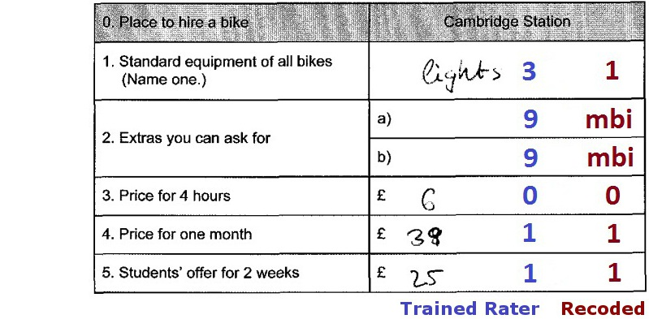

# Main Functions

## Introduction

#### Installation

You can install the package using the following line of code:

``` r

#remotes::install_github("https://github.com/sachseka/eatPrep")
library(eatPrep)
```

#### Outline

In this vignette we explain how to use the package’s main functions.
Main functions are functions that are part of the minimal workflow of
data preparation for IRT analyses using item meta data, that is,
performing checks, merging, recoding, aggregating and scoring variables.
For explanation of further important functions and diagnostic tools for
data preparation and plausibility checks, there will be another
vignette.

You can click on the specific function to jump to its explanation.

| Function | Explanation |
|:---|:---|
| **Reading in (Meta) Data** |  |
| [readDaemonXlsx()](#items-via-zkdaemon) | read in the inputlist that was created using the EDV-tool ‘ZKDaemon’. |
| [readSpss()](#spss-data) | read in SPSS files. |
| [readMerkmalXlsx()](#merkmalsauszug) | read in additional item and exercise attributes like processing time, formats, content categories, … |
| **Checks** |  |
| [checkInputList()](#checkinputlist) | check the inputList for internal consistency. |
| [checkData()](#checkdata) | check data sets according to item meta information and other plausibility checks of the data. |
| [checkDesign()](#checkdesign) | check data sets according to test design meta information. |
| **Merging, Recoding, Aggregating, Scoring** |  |
| [mergeData()](#merging-data) | merging the data sets and diagnostics to ensure a fit. |
| [recodeData()](#recoding-data) | recode the subitems according to meta information from the inputList. |
| [aggregateData()](#aggregating-data) | aggregate subitems into items. |
| [scoreData()](#scoring-data) | recode items that previously consisted out of subitems. |
| [mnrCoding()](#mnrcoding) | recoding the last items (if empty) in each block (see test design) as ‘missing not reached’. |
| **Wrapper** |  |
| [automateDataPreparation()](#wrapper) | wraps most of the other features into one big function. |
| **Additional Diagnostics and Rater Tools** |  |
| [catPbc()](#category-discrimination) | calculates category-level point-biserial correlations for recoded and raw item data. |
| [evalPbc()](#category-discrimination) | flags suspicious category discrimination patterns from the output of [`catPbc()`](https://sachseka.github.io/eatPrep/reference/cat.pbc.md). |
| [meanAgree()](#rater-agreement) | calculates mean pairwise percentage agreement across raters. |
| [meanKappa()](#rater-agreement) | calculates mean pairwise kappa across raters. |
| [make.pseudo()](#pseudo-raters) | reduces multiple real raters to a smaller number of pseudo raters. |
| [computeCutsIDM()](#idm-cut-scores) | computes cut scores for Item Descriptor Matching based on monotonized moving averages. |
| [plotCutsIDM()](#idm-cut-scores) | plots the raw ratings, moving averages, monotonized curves and cut scores from [`computeCutsIDM()`](https://sachseka.github.io/eatPrep/reference/computeCutsIDM.md). |
| [visualSubsetRecode()](#visual-subset-recoding) | supports interactive visual inspection and recoding of flagged subsets. |
| **Export** |  |
| [collapseMissings()](#collapsing-data) | recodes missing types into predefined scores (usually 0, 1, and NA). Such a collapsed R data frame can be passed directly to eatModel for scaling. |
| [writeSpss()](#export-spss) | produces an SPSS syntax and a .txt data set that can be read into SPSS with the syntax including all meta data. |
| [prep2GADS()](#prepare-for-eatgads) | both the raw data sets and the finished, scored data sets, including all their meta data, can be exported into a GADSdat object for data storage or further processing in eatGADS. |

**Functions Overview** {.table}

#### Data Structure

In the [Getting Started
Vignette](https://sachseka.github.io/eatPrep/articles/getting_started.md)
we saw what we use the `eatPrep` package for and how the data structure
looks like. Now, we will look at the main functions to learn how to
implement that via R.

As a reminder, an `eatPrep` data set contains the following layers:

|              |                                      |
|--------------|--------------------------------------|
| **booklets** | containing blocks                    |
| **blocks**   | containing units (= items)           |
| **units**    | containing subunits/subitems         |
| **subunits** | having values and                    |
| **values**   | including missings and recode values |

And here is an overview for different value types the IQB uses:

| Code | Label | Abbr | Explanation |
|:---|:---|:---|:---|
| -98 | mir | missing invalid response | \(1\) Item was edited, and (2a) empty answer or (2b) invalid (joke) answer. |
| -99 | mbo | missing by omission | Item wasn’t edited but seen, or wasn’t seen, but there are seen or edited subsequent Items. |
| -96 | mnr | missing not reached | \(1\) Item wasn’t seen, and (2) all subsequent Items weren’t seen, either. |
| -97 | mci | missing coding impossible | \(1\) Item should/could have been edited, and (2) answer can’t be analysed due to technical problems. |
| -94 | mbd | missing by design | no answer, because Item wasn’t shown to the testperson by design. |

**Missing Types** {.table}

## Input

`inputMinimal` contains the bare minimum for all functions in `eatPrep`
to work, `inputList` contains additional meta data about the items (such
as information about the task’s content).

For more information on how the different layers or input tables look,
please see the [Getting Started
Vignette](https://sachseka.github.io/eatPrep/articles/getting_started.md).

``` r

inputMinimal <- list(units = inputList$units[ -nrow(inputList$units), c("unit", "unitAggregateRule")],
                     subunits = inputList$subunits[, c("unit", "subunit","subunitRecoded")],
                     values = inputList$values[ , c("subunit", "value", "valueRecode", "valueType")],
                     unitRecodings = inputList$unitRecodings[ , c("unit", "value", "valueRecode", "valueType")],
                     blocks = inputList$blocks,
                     booklets = inputList$booklets,
                     rotation = inputList$rotation)
```

## Input Data

We have several overlapping booklets with several blocks in each
booklet. Moreover, there is a unique identifier for each person and some
additional information about each student like their gender or their
socioeconomic status. There is one data set per booklet. In order to
prepare the data, we need to construct one large data set.

In order to do that we first need to read the data into R, check the
data for invalid or incorrect codes and then merge the data into one
data set. In the following the different functions to do that are
described. `inputDat` gives us a first idea on how the data is supposed
to look like.

``` r

# looking at the data
str(inputDat)
#> List of 3
#>  $ booklet1:'data.frame':    100 obs. of  25 variables:
#>   ..$ ID   : chr [1:100] "person100" "person101" "person102" "person103" ...
#>   ..$ hisei: num [1:100] 49 NA 57 32 59 56 55 47 NA 50 ...
#>   ..$ I01  : chr [1:100] "1" "9" "3" "2" ...
#>   ..$ I02  : chr [1:100] "4" "4" "4" "4" ...
#>   ..$ I03  : chr [1:100] "1" "2" "2" "3" ...
#>   ..$ I04  : chr [1:100] "2" "2" "3" "1" ...
#>   ..$ I05  : chr [1:100] "0" "0" "0" "1" ...
#>   ..$ I06  : chr [1:100] "0" "9" "0" "1" ...
#>   ..$ I07  : chr [1:100] "2" "2" "2" "3" ...
#>   ..$ I08  : chr [1:100] "0" "1" "0" "0" ...
#>   ..$ I09  : chr [1:100] "2" "2" "2" "3" ...
#>   ..$ I10  : chr [1:100] "2" "1" "1" "4" ...
#>   ..$ I11  : chr [1:100] "4" "1" "3" "2" ...
#>   ..$ I12a : chr [1:100] "1" "0" "1" "0" ...
#>   ..$ I12b : chr [1:100] "0" "9" "0" "1" ...
#>   ..$ I12c : chr [1:100] "4" "1" "2" "4" ...
#>   ..$ I13  : chr [1:100] "9" "4" "9" "4" ...
#>   ..$ I14  : chr [1:100] "9" "4" "9" "1" ...
#>   ..$ I15  : chr [1:100] "9" "3" "9" "1" ...
#>   ..$ I16  : chr [1:100] "9" "2" "9" "2" ...
#>   ..$ I17  : chr [1:100] "9" "3" "9" "4" ...
#>   ..$ I18  : chr [1:100] "9" "1" "9" "1" ...
#>   ..$ I19  : chr [1:100] "9" "4" "9" "2" ...
#>   ..$ I20  : chr [1:100] "9" "1" "9" "1" ...
#>   ..$ I21  : chr [1:100] "9" "2" "9" "3" ...
#>  $ booklet2:'data.frame':    100 obs. of  25 variables:
#>   ..$ ID   : chr [1:100] "person200" "person201" "person202" "person203" ...
#>   ..$ hisei: num [1:100] 69 76 47 58 62 78 70 26 57 70 ...
#>   ..$ I08  : chr [1:100] "0" "0" "1" "0" ...
#>   ..$ I09  : chr [1:100] "2" "4" "1" "2" ...
#>   ..$ I10  : chr [1:100] "3" "1" "2" "2" ...
#>   ..$ I11  : chr [1:100] "4" "2" "1" "4" ...
#>   ..$ I12a : chr [1:100] "1" "0" "1" "1" ...
#>   ..$ I12b : chr [1:100] "1" "0" "1" "1" ...
#>   ..$ I12c : chr [1:100] "4" "3" "2" "2" ...
#>   ..$ I13  : chr [1:100] "4" "2" "1" "2" ...
#>   ..$ I14  : chr [1:100] "3" "4" "2" "3" ...
#>   ..$ I15  : chr [1:100] "4" "1" "4" "4" ...
#>   ..$ I16  : chr [1:100] "4" "3" "3" "2" ...
#>   ..$ I17  : chr [1:100] "4" "1" "2" "3" ...
#>   ..$ I18  : chr [1:100] "1" "4" "3" "2" ...
#>   ..$ I19  : chr [1:100] "2" "1" "4" "3" ...
#>   ..$ I20  : chr [1:100] "4" "9" "2" "2" ...
#>   ..$ I21  : chr [1:100] "2" "9" "2" "1" ...
#>   ..$ I22  : chr [1:100] "1" "9" "2" "1" ...
#>   ..$ I23  : chr [1:100] "9" "9" "2" "3" ...
#>   ..$ I24  : chr [1:100] "1" "9" "3" "3" ...
#>   ..$ I25  : chr [1:100] "1" "9" "0" "0" ...
#>   ..$ I26  : chr [1:100] "9" "9" "1" "0" ...
#>   ..$ I27  : chr [1:100] "0" "9" "1" "0" ...
#>   ..$ I28  : chr [1:100] "1" "9" "1" "0" ...
#>  $ booklet3:'data.frame':    100 obs. of  23 variables:
#>   ..$ ID   : chr [1:100] "person300" "person301" "person302" "person303" ...
#>   ..$ hisei: num [1:100] 49 NA 57 32 59 56 55 47 NA 50 ...
#>   ..$ I01  : chr [1:100] "2" "3" "2" "1" ...
#>   ..$ I02  : chr [1:100] "4" "3" "3" "3" ...
#>   ..$ I03  : chr [1:100] "3" "1" "1" "1" ...
#>   ..$ I04  : chr [1:100] "1" "3" "1" "1" ...
#>   ..$ I05  : chr [1:100] "0" "1" "1" "0" ...
#>   ..$ I06  : chr [1:100] "9" "1" "0" "1" ...
#>   ..$ I07  : chr [1:100] "8" "2" "2" "1" ...
#>   ..$ I15  : chr [1:100] "3" "9" "9" "9" ...
#>   ..$ I16  : chr [1:100] "1" "3" "3" "3" ...
#>   ..$ I17  : chr [1:100] "4" "4" "4" "4" ...
#>   ..$ I18  : chr [1:100] "4" "4" "4" "4" ...
#>   ..$ I19  : chr [1:100] "2" "9" "9" "9" ...
#>   ..$ I20  : chr [1:100] "3" "4" "2" "4" ...
#>   ..$ I21  : chr [1:100] "3" "2" "2" "2" ...
#>   ..$ I22  : chr [1:100] "3" "4" "4" "9" ...
#>   ..$ I23  : chr [1:100] "3" "1" "1" "9" ...
#>   ..$ I24  : chr [1:100] "1" "1" "1" "9" ...
#>   ..$ I25  : chr [1:100] "0" "1" "9" "9" ...
#>   ..$ I26  : chr [1:100] "1" "0" "9" "9" ...
#>   ..$ I27  : chr [1:100] "0" "9" "9" "9" ...
#>   ..$ I28  : chr [1:100] "0" "9" "9" "9" ...
```

### Reading in (Meta) Data

First, we need to get the information from our IQB data bank via
ZKDaemon, or alternatively via SPSS.

#### Items via ZKDaemon

ZKDaemon is a program used by IQB that can be found in the IQB internal
folders (i:). After installing you can get the meta data and the items
from your specific study using information stored in the IQB Databases
(DB2/DB3/DB4). Alternatively you can get the meta data from an SPSS file
via ZKDaemon. Within the program you can set missing types and import a
test design. Then you can produce Excel files, which are expected to
have the following sheets: “units”, “subunits”, “values”,
“unitrecoding”, “sav-files”, “params”, “aggregate-missings”,
“itemproperties”, “propertylabels”, “booklets”, and “blocks”.

The function
[`readDaemonXlsx()`](https://sachseka.github.io/eatPrep/reference/readDaemonXlsx.md)
reads the Excel file into R and will produce a warning if any sheets are
missing. It needs one character string (filename) containing path, name
and extension of the Excel file (.xlsx) produced by ZKDaemon.

The function returns a list of data frames containing information that
is required by the data preparation functions. `inputList` shows an
example of this list.

``` r

filename <- system.file("extdata", "inputList.xlsx", package = "eatPrep")
readDaemon <- readDaemonXlsx(filename)
#> Reading sheet 'units'.
#> Reading sheet 'subunits'.
#> Reading sheet 'values'.
#> Reading sheet 'unitrecoding'.
#> Reading sheet 'sav-files'.
#> Reading sheet 'params'.
#> Reading sheet 'aggregate-missings'.
#> Reading sheet 'booklets'.
#> Reading sheet 'blocks'.
str(readDaemon)
#> List of 9
#>  $ units        :'data.frame':   29 obs. of  6 variables:
#>   ..$ unit             : chr [1:29] "I01" "I02" "I03" "I04" ...
#>   ..$ unitLabel        : chr [1:29] "Animals: Weight of a duck" "Animals: Weight of a horse" "Animals: Weight of a mouse" "Animals: Weight of a cat" ...
#>   ..$ unitDescription  : chr [1:29] NA NA NA NA ...
#>   ..$ unitType         : chr [1:29] "TI" "TI" "TI" "TI" ...
#>   ..$ unitAggregateRule: chr [1:29] NA NA NA NA ...
#>   ..$ unitScoreRule    : chr [1:29] NA NA NA NA ...
#>  $ subunits     :'data.frame':   30 obs. of  9 variables:
#>   ..$ unit               : chr [1:30] "I01" "I02" "I03" "I04" ...
#>   ..$ subunit            : chr [1:30] "I01" "I02" "I03" "I04" ...
#>   ..$ subunitType        : chr [1:30] "1" "1" "1" "1" ...
#>   ..$ subunitLabel       : chr [1:30] "Animals: Weight of a duck" "Animals: Weight of a horse" "Animals: Weight of a mouse" "Animals: Weight of a cat" ...
#>   ..$ subunitDescription : chr [1:30] NA NA NA NA ...
#>   ..$ subunitPosition    : chr [1:30] "a)" "b)" "c)" "d)" ...
#>   ..$ subunitTransniveau : chr [1:30] NA NA NA NA ...
#>   ..$ subunitRecoded     : chr [1:30] "I01R" "I02R" "I03R" "I04R" ...
#>   ..$ subunitLabelRecoded: chr [1:30] "Recoded Animals: Weight of a duck" "Recoded Animals: Weight of a horse" "Recoded Animals: Weight of a mouse" "Recoded Animals: Weight of a cat" ...
#>  $ values       :'data.frame':   220 obs. of  8 variables:
#>   ..$ subunit                : chr [1:220] "I01" "I01" "I01" "I01" ...
#>   ..$ value                  : chr [1:220] "1" "2" "3" "6" ...
#>   ..$ valueRecode            : chr [1:220] "0" "0" "1" "mnr" ...
#>   ..$ valueType              : chr [1:220] "vc" "vc" "vc" "mnr" ...
#>   ..$ valueLabel             : chr [1:220] "Response option 1 marked" "Response option 2 marked" "Response option 3 marked" "missing not reached" ...
#>   ..$ valueDescription       : chr [1:220] "Response option 1 marked" "Response option 2 marked" "Response option 3 marked" "missing not reached" ...
#>   ..$ valueLabelRecoded      : chr [1:220] "0" "0" "1" "mnr" ...
#>   ..$ valueDescriptionRecoded: chr [1:220] NA NA NA NA ...
#>  $ unitRecodings:'data.frame':   7 obs. of  7 variables:
#>   ..$ unit             : chr [1:7] "I12" "I12" "I12" "I12" ...
#>   ..$ value            : chr [1:7] "0" "1" "2" "3" ...
#>   ..$ valueRecode      : chr [1:7] "0" "0" "0" "1" ...
#>   ..$ valueType        : chr [1:7] "vc" "vc" "vc" "vc" ...
#>   ..$ valueLabel       : chr [1:7] NA NA NA NA ...
#>   ..$ valueDescription : chr [1:7] NA NA NA NA ...
#>   ..$ valueLabelRecoded: chr [1:7] NA NA NA NA ...
#>  $ savFiles     :'data.frame':   3 obs. of  3 variables:
#>   ..$ filename: chr [1:3] "booklet1.sav" "booklet2.sav" "booklet3.sav"
#>   ..$ case.id : chr [1:3] "ID" "ID" "ID"
#>   ..$ fullname: chr [1:3] NA NA NA
#>  $ newID        :'data.frame':   1 obs. of  2 variables:
#>   ..$ key  : chr "master-id"
#>   ..$ value: chr "ID"
#>  $ aggrMiss     :'data.frame':   7 obs. of  8 variables:
#>   ..$ nam: chr [1:7] "vc" "mvi" "mnr" "mci" ...
#>   ..$ vc : chr [1:7] "vc" "mvi" "vc" "mci" ...
#>   ..$ mvi: chr [1:7] "mvi" "mvi" "err" "mci" ...
#>   ..$ mnr: chr [1:7] "vc" "err" "mnr" "mci" ...
#>   ..$ mci: chr [1:7] "mci" "mci" "mci" "mci" ...
#>   ..$ mbd: chr [1:7] "err" "err" "err" "err" ...
#>   ..$ mir: chr [1:7] "vc" "err" "mir" "mci" ...
#>   ..$ mbi: chr [1:7] "vc" "err" "mnr" "mci" ...
#>  $ booklets     :'data.frame':   3 obs. of  4 variables:
#>   ..$ booklet: chr [1:3] "booklet1" "booklet2" "booklet3"
#>   ..$ block1 : chr [1:3] "bl1" "bl4" "bl3"
#>   ..$ block2 : chr [1:3] "bl2" "bl3" "bl1"
#>   ..$ block3 : chr [1:3] "bl3" "bl2" "bl4"
#>  $ blocks       :'data.frame':   30 obs. of  3 variables:
#>   ..$ subunit             : chr [1:30] "I01" "I02" "I03" "I04" ...
#>   ..$ block               : chr [1:30] "bl1" "bl1" "bl1" "bl1" ...
#>   ..$ subunitBlockPosition: chr [1:30] "1" "2" "3" "4" ...
```

#### SPSS Data

To get the input from SPSS data files,
[`readSpss()`](https://sachseka.github.io/eatPrep/reference/readSpss.md)
reads the data into R and converts all variables to the class
`character`. The function needs the name of the SPSS data file and has
the option to specify some more attributes. For more information use the
help function
[`?readSpss`](https://sachseka.github.io/eatPrep/reference/readSpss.md).

``` r

#readSpss(system.file("extdata", "booklet1.sav", package = "eatPrep"))
#readSpss(system.file("extdata", "booklet2.sav", package = "eatPrep"))
#readSpss(system.file("extdata", "booklet3.sav", package = "eatPrep"))
```

#### Merkmalsauszug

The software “IQB Item-DB” produces Excel files named “Merkmalsauszug”
using information stored in the IQB Databases. The file is expected to
have the sheets: “Itemmerkmale”, “Aufgabenmerkmale”. The order doesn’t
matter. The file contains information about the attributes of the items
and exercises.

The function
[`readMerkmalXlsx()`](https://sachseka.github.io/eatPrep/reference/readMerkmalXlsx.md)
reads the Excel file into R and will produce a warning if any sheets are
missing or wrongly specified. It needs one character string (filename)
containing path, name and extension of the Excel file (.xlsx) produced
by IQB Item-DB. By default, the Item-ID is created without converting
numbers to lowercase letters (`tolcl`) and a merged data frame
containing both “Itemmerkmale” and “Aufgabenmerkmale” will be created
(`alleM`).

The function returns a list of data frames containing Itemmerkmale,
Aufgabenmerkmale and AlleMerkmale (optional).

``` r

filename <- system.file("extdata", "itemmerkmale.xlsx", package = "eatPrep")
readMerkmalXlsx(filename, tolcl = FALSE, alleM = TRUE)
#> Reading sheet 'Aufgabenmerkmale'.
#> Reading sheet 'Itemmerkmale'.
#> Data frame 'AlleMerkmale' has been created.
#> $Aufgabenmerkmale
#>                      Aufgabe Zeit.A                     AufgID AufgTitel
#> 1  Animals: Weight of a duck   0:00  Animals: Weight of a duck        NA
#> 2 Animals: Weight of a horse   0:00 Animals: Weight of a horse        NA
#> 
#> $Itemmerkmale
#>                      Aufgabe Teilaufgabe Item Zeit.I Anforderungsbereich.MaP
#> 1  Animals: Weight of a duck           A   01   0:00                       I
#> 2 Animals: Weight of a horse           A   01   0:00                       I
#> 3 Animals: Weight of a horse           B   02   0:00                      II
#>   Bildungsstandards.MaP.allgemeine                Itemtyp.5er
#> 1                               1a GA - Geschlossen Ankreuzen
#> 2                             <NA> GA - Geschlossen Ankreuzen
#> 3                             <NA> GA - Geschlossen Ankreuzen
#>                       AufgID AufgTitel                       ItemID
#> 1  Animals: Weight of a duck        NA  Animals: Weight of a duck01
#> 2 Animals: Weight of a horse        NA Animals: Weight of a horse01
#> 3 Animals: Weight of a horse        NA Animals: Weight of a horse02
#> 
#> $AlleMerkmale
#>                       AufgID                    Aufgabe Teilaufgabe Item
#> 1  Animals: Weight of a duck  Animals: Weight of a duck           A   01
#> 2 Animals: Weight of a horse Animals: Weight of a horse           A   01
#> 3 Animals: Weight of a horse Animals: Weight of a horse           B   02
#>                         ItemID Zeit.I Anforderungsbereich.MaP
#> 1  Animals: Weight of a duck01   0:00                       I
#> 2 Animals: Weight of a horse01   0:00                       I
#> 3 Animals: Weight of a horse02   0:00                      II
#>   Bildungsstandards.MaP.allgemeine                Itemtyp.5er Zeit.A
#> 1                               1a GA - Geschlossen Ankreuzen   0:00
#> 2                             <NA> GA - Geschlossen Ankreuzen   0:00
#> 3                             <NA> GA - Geschlossen Ankreuzen   0:00
```

## Checks

After reading in all the data, we need to check, whether it is in the
right format and all codes and missing codes were assigned correctly.

#### checkInputList

[`checkInputList()`](https://sachseka.github.io/eatPrep/reference/checkInputList.md)
checks whether the object `inputList` has the required form. It has two
arguments: the `inputList` and `mistypes`. The `mistypes` argument
defines the missing types that should be checked in `valueRecode` and
`valueType`.

``` r

data(inputList)
checkInputList(inputList)
```

The xlsx-file produced by ‘ZKDaemon’ is expected to have the following
sheets: “units”, “subunits”, “values”, “unitrecoding”, “sav-files”,
“params”, “aggregate-missings”, “itemproperties”, “propertylabels”,
“booklets”, and “blocks”. `readDaemonXlsx` will produce a warning if any
sheets are missing or wrongly specified. `checkInputList` performs many
additional checks to this.

#### checkData

[`checkData()`](https://sachseka.github.io/eatPrep/reference/checkData.md)
checks data frames for missing or duplicated entries in the ID variable,
persons and/or variables without valid codes, and generally invalid
codes. The results of that check will be written in the console.

The function needs a data frame to be checked (`dat`) and its name
(`datnam`), especially if there are multiple data frames (e.g. a list of
data frames). Furthermore it needs data frames with code, subunit and
unit information (`values`, `subunits` and `units`), and a string for an
ID column name (ID). You can turn off printing information to the
console with `verbose`.

``` r

checkData(dat, datnam, values, subunits, units, ID = NULL, verbose = TRUE)
```

Examples of data frames for `values`, `subunits` and `units` can be
found by typing `inputList` in the console.

#### checkDesign

[`checkDesign()`](https://sachseka.github.io/eatPrep/reference/checkDesign.md)
checks whether a data frame corresponds to a particular rotated block
design, i.e. whether all persons have valid codes on all items they were
presented with and one consistent missing code for all items they were
not presented with.

The function also needs a data frame to be checked (`dat`), as well as
data frames containing information on the number and column names of
blocks in each booklet (`booklets`), on the names of subunits and their
order within each block (`blocks`) and about which participant worked on
which booklet (`rotation`). `sysMis` specifies the missing code for
items that were not administered to a participant and `id` indicates the
name of the participant identifier variable in `dat`. This is needed,
when you perform
[`checkDesign()`](https://sachseka.github.io/eatPrep/reference/checkDesign.md)
on a data frame that is the result of
[`recodeData()`](https://sachseka.github.io/eatPrep/reference/recodeData.md)
which renames `subunits` according to `subunitRecoded` in `subunits`
sheet.

`subunits` is an optional argument to identify the names of recoded
subunits. And you can turn off printing information with `verbose`.

``` r

checkDesign(dat, booklets, blocks, rotation, sysMis="NA", id="ID", subunits = NULL, verbose = TRUE)
```

`inputDat` and `inputList` are examples on how these data frames are
supposed to look like. When you copy and paste the following code in
your console, you can look at the data frames.

``` r

data(inputDat)
data(inputList)
```

## Merging, Recoding, Aggregating, Scoring

### Merging Data

Now that we checked that the data frames meet our requirements, we can
merge a list of data frames into a single data frame by using
[`mergeData()`](https://sachseka.github.io/eatPrep/reference/mergeData.md).
For that we need a list of data frames, like `inputDat` which contains
data of three booklets. The function returns a data frame containing
unique cases and unique variables. All cases and all variables from the
original data sets will be kept and matched.

[`mergeData()`](https://sachseka.github.io/eatPrep/reference/mergeData.md)
provides detailed diagnostics about value mismatches. If two identically
named columns in two data sets do not have identical values, NAs are
replaced by valid codes stemming from the other data set(s) and if two
different valid values are found, the first value will be kept and the
other dropped, and the user will be informed about the mismatch.
Additionally, `NA` resulting from the merge (e.g., in repeated block
designs) can be replaced with a custom character missing to facilitate
future data preparation of the merged data set. See Table [Missing
Types](#data-structure) for standard missing types for other functions
in the `eatPrep` package.

When merging data frames with this function you need to specify at least
two arguments: `newID` and `datList`. `newID` has to be a character
vector length one indicating the name of the identifier variable (ID) in
the merged data set and/or the name of the ID in every data frame in
`datList`, if not specified differently in `oldIDs`. `datList` is the
list of data frames to be merged, e.g. `inputDat`.

``` r

mergedDataset <- mergeData(newID = "ID", datList = inputDat)
#> Start merging of dataset 1.
#> Start merging of dataset 2.
#> Start merging of dataset 3.
str(mergedDataset)
#> 'data.frame':    300 obs. of  32 variables:
#>  $ ID   : chr  "person100" "person101" "person102" "person103" ...
#>  $ hisei: num  49 NA 57 32 59 56 55 47 NA 50 ...
#>  $ I01  : chr  "1" "9" "3" "2" ...
#>  $ I02  : chr  "4" "4" "4" "4" ...
#>  $ I03  : chr  "1" "2" "2" "3" ...
#>  $ I04  : chr  "2" "2" "3" "1" ...
#>  $ I05  : chr  "0" "0" "0" "1" ...
#>  $ I06  : chr  "0" "9" "0" "1" ...
#>  $ I07  : chr  "2" "2" "2" "3" ...
#>  $ I08  : chr  "0" "1" "0" "0" ...
#>  $ I09  : chr  "2" "2" "2" "3" ...
#>  $ I10  : chr  "2" "1" "1" "4" ...
#>  $ I11  : chr  "4" "1" "3" "2" ...
#>  $ I12a : chr  "1" "0" "1" "0" ...
#>  $ I12b : chr  "0" "9" "0" "1" ...
#>  $ I12c : chr  "4" "1" "2" "4" ...
#>  $ I13  : chr  "9" "4" "9" "4" ...
#>  $ I14  : chr  "9" "4" "9" "1" ...
#>  $ I15  : chr  "9" "3" "9" "1" ...
#>  $ I16  : chr  "9" "2" "9" "2" ...
#>  $ I17  : chr  "9" "3" "9" "4" ...
#>  $ I18  : chr  "9" "1" "9" "1" ...
#>  $ I19  : chr  "9" "4" "9" "2" ...
#>  $ I20  : chr  "9" "1" "9" "1" ...
#>  $ I21  : chr  "9" "2" "9" "3" ...
#>  $ I22  : chr  NA NA NA NA ...
#>  $ I23  : chr  NA NA NA NA ...
#>  $ I24  : chr  NA NA NA NA ...
#>  $ I25  : chr  NA NA NA NA ...
#>  $ I26  : chr  NA NA NA NA ...
#>  $ I27  : chr  NA NA NA NA ...
#>  $ I28  : chr  NA NA NA NA ...
```

Furthermore, you can specify some more arguments, but they have default
options, so you don’t need to. Here is an example where the IDs are
changed via `oldIDs` and where NAs are replaced by “mbd” (missing by
design). For more information use the help function
[`?mergeData`](https://sachseka.github.io/eatPrep/reference/mergeData.md).

``` r

mergedDataset2 <- mergeData(newID = "idstud", datList = inputDat, oldIDs = c("ID", "ID", "ID"), addMbd = TRUE)
#> Start merging of dataset 1.
#> Start merging of dataset 2.
#> Start merging of dataset 3.
#> Start adding mbd according to data pattern.
str(mergedDataset2)
#> 'data.frame':    300 obs. of  32 variables:
#>  $ idstud: chr  "person100" "person101" "person102" "person103" ...
#>  $ hisei : num  49 NA 57 32 59 56 55 47 NA 50 ...
#>  $ I01   : chr  "1" "9" "3" "2" ...
#>  $ I02   : chr  "4" "4" "4" "4" ...
#>  $ I03   : chr  "1" "2" "2" "3" ...
#>  $ I04   : chr  "2" "2" "3" "1" ...
#>  $ I05   : chr  "0" "0" "0" "1" ...
#>  $ I06   : chr  "0" "9" "0" "1" ...
#>  $ I07   : chr  "2" "2" "2" "3" ...
#>  $ I08   : chr  "0" "1" "0" "0" ...
#>  $ I09   : chr  "2" "2" "2" "3" ...
#>  $ I10   : chr  "2" "1" "1" "4" ...
#>  $ I11   : chr  "4" "1" "3" "2" ...
#>  $ I12a  : chr  "1" "0" "1" "0" ...
#>  $ I12b  : chr  "0" "9" "0" "1" ...
#>  $ I12c  : chr  "4" "1" "2" "4" ...
#>  $ I13   : chr  "9" "4" "9" "4" ...
#>  $ I14   : chr  "9" "4" "9" "1" ...
#>  $ I15   : chr  "9" "3" "9" "1" ...
#>  $ I16   : chr  "9" "2" "9" "2" ...
#>  $ I17   : chr  "9" "3" "9" "4" ...
#>  $ I18   : chr  "9" "1" "9" "1" ...
#>  $ I19   : chr  "9" "4" "9" "2" ...
#>  $ I20   : chr  "9" "1" "9" "1" ...
#>  $ I21   : chr  "9" "2" "9" "3" ...
#>  $ I22   : chr  "mbd" "mbd" "mbd" "mbd" ...
#>  $ I23   : chr  "mbd" "mbd" "mbd" "mbd" ...
#>  $ I24   : chr  "mbd" "mbd" "mbd" "mbd" ...
#>  $ I25   : chr  "mbd" "mbd" "mbd" "mbd" ...
#>  $ I26   : chr  "mbd" "mbd" "mbd" "mbd" ...
#>  $ I27   : chr  "mbd" "mbd" "mbd" "mbd" ...
#>  $ I28   : chr  "mbd" "mbd" "mbd" "mbd" ...
```

### Recoding Data

After importing the data and making sure it has the right format, the
next step is to adjust the missing values.

First, you recode data sets with several kinds of missing values. For
that, you need recode information with special consideration of missing
values. See
[`collapseMissings()`](https://sachseka.github.io/eatPrep/reference/collapseMissings.md)
for supported types of missing values.
[`recodeData()`](https://sachseka.github.io/eatPrep/reference/recodeData.md)
recodes the specified data frames and will give warnings if missing or
incomplete recode information is found. Values without recode
information will not be recoded.

Examples of data frames `values` and `subunits` can be found when
copy-pasting the following code into your console:

``` r

inputList$values
inputList$subunits
```

[`recodeData()`](https://sachseka.github.io/eatPrep/reference/recodeData.md)
uses the recode information from those two data frames and recodes the
variables on `dat` accordingly. The columns will be named according to
the specifications in `subunits$subunitRecoded`, if `subunits` is not
provided, item names will not be changed for recoded items.

``` r

datRec <- recodeData(dat = inputDat[[1]], values = inputList$values, subunits = inputList$subunits, verbose = TRUE)
#> 
#> Found no recode information for variable(s): 
#> ID, hisei. 
#> This/These variable(s) will not be recoded.
#> 
#> Variables... I01, I02, I03, I04, I05, I06, I07, I08, I09, I10, I11, I12a, I12b, I12c, I13, I14, I15, I16, I17, I18, I19, I20, I21
#> ...have been recoded.
str(datRec)
#> 'data.frame':    100 obs. of  25 variables:
#>  $ ID   : chr  "person100" "person101" "person102" "person103" ...
#>  $ hisei: chr  "49" NA "57" "32" ...
#>  $ I01R : chr  "0" "mbi" "1" "0" ...
#>  $ I02R : chr  "0" "0" "0" "0" ...
#>  $ I03R : chr  "0" "1" "1" "0" ...
#>  $ I04R : chr  "1" "1" "0" "0" ...
#>  $ I05R : chr  "0" "0" "0" "1" ...
#>  $ I06R : chr  "0" "mbi" "0" "1" ...
#>  $ I07R : chr  "0" "0" "0" "0" ...
#>  $ I08R : chr  "0" "1" "0" "0" ...
#>  $ I09R : chr  "0" "0" "0" "0" ...
#>  $ I10R : chr  "1" "0" "0" "0" ...
#>  $ I11R : chr  "0" "0" "1" "0" ...
#>  $ I12aR: chr  "1" "0" "1" "0" ...
#>  $ I12bR: chr  "0" "mbi" "0" "1" ...
#>  $ I12cR: chr  "1" "0" "0" "1" ...
#>  $ I13R : chr  "mbi" "0" "mbi" "0" ...
#>  $ I14R : chr  "mbi" "0" "mbi" "0" ...
#>  $ I15R : chr  "mbi" "0" "mbi" "1" ...
#>  $ I16R : chr  "mbi" "0" "mbi" "0" ...
#>  $ I17R : chr  "mbi" "0" "mbi" "0" ...
#>  $ I18R : chr  "mbi" "1" "mbi" "1" ...
#>  $ I19R : chr  "mbi" "1" "mbi" "0" ...
#>  $ I20R : chr  "mbi" "0" "mbi" "0" ...
#>  $ I21R : chr  "mbi" "0" "mbi" "1" ...
```

### Aggregating Data

After recoding missing values, the subunits are combined one by one via
[`aggregateData()`](https://sachseka.github.io/eatPrep/reference/aggregateData.md).



Items and subitems that can be aggregated

This function needs three data frames: one containing the data to be
aggregated (`dat`), one containing the subunit information (`subunits`),
and one containing the unit information (`units`).

|              |                                |
|--------------|--------------------------------|
| **vc**       | valid code                     |
| **colnames** | missing types to be aggregated |
| **rownames** | missing types to be aggregated |

Optionally, you can specify how missing values should be aggregated
(`aggregatemissings`) like in the example, or which column names the
returned data frame should have (`recodedData`), for instance. Type
[`?aggregateData`](https://sachseka.github.io/eatPrep/reference/aggregateData.md)
into your console to learn more.

``` r

am <- matrix(c(
  "vc" , "mvi", "vc" , "mci", "err", "vc" , "mbi", "err",
  "mvi", "mvi", "err", "mci", "err", "err", "err", "err",
  "vc" , "err", "mnr", "mci", "err", "mir", "mnr", "err",
  "mci", "mci", "mci", "mci", "err", "mci", "mci", "err",
  "err", "err", "err", "err", "mbd", "err", "err", "err",
  "vc" , "err", "mir", "mci", "err", "mir", "mir", "err",
  "mbi", "err", "mnr", "mci", "err", "mir", "mbi", "err",
  "err", "err", "err", "err", "err", "err", "err", "err" ),
  nrow = 8, ncol = 8, byrow = TRUE)

dimnames(am) <-
  list(c("vc" ,"mvi", "mnr", "mci",  "mbd", "mir", "mbi", "err"),
       c("vc" ,"mvi", "mnr", "mci",  "mbd", "mir", "mbi", "err"))
```

``` r

# using datRec from the chapter "recodeData()"
datAggr <- aggregateData(datRec, inputList$subunits, inputList$units,
    aggregatemissings = am, rename = TRUE, recodedData = TRUE,
    suppressErr = TRUE, recodeErr = "mci", verbose = TRUE)
#> All aggregation rules will be defaulted to 'SUM', because no other type is currently supported.
#> Found 20 unit(s) with only one subunit in 'dat'. This/these subunit(s) will not be aggregated and renamed to their respective unit name(s).
#> 1 units were aggregated: I12.
```

### Scoring Data

The next step is to score a data set with special consideration of
missing values. The function
[`scoreData()`](https://sachseka.github.io/eatPrep/reference/scoreData.md)
is very similar to
[`recodeData()`](https://sachseka.github.io/eatPrep/reference/recodeData.md),
but with a few defaults that are better suited for scoring.
[`scoreData()`](https://sachseka.github.io/eatPrep/reference/scoreData.md)
will give warnings when incomplete scoring information is found. Values
without scoring information will not be scored.

Again, you need to specify three data frames. One data frame that you
get after completing the steps you did so far or by using
`automateDataPreparation` (`dat`), one with information about the
scoring of units (`unitrecodings`), and one with subunit information
(`subunits`). Examples for the last two data frames can be found via
`inputList`.

``` r

prepDat <- automateDataPreparation (inputList = inputList, datList = inputDat,
    readSpss = FALSE, checkData=FALSE, mergeData = TRUE, recodeData=TRUE,
    aggregateData=TRUE, scoreData= FALSE, writeSpss=FALSE, verbose = TRUE)
```

``` r

datSco <- scoreData(prepDat, inputList$unitRecodings, inputList$subunits,
    verbose = TRUE)
#> ✔ 1 unit was scored: `I12`.
```

#### mnrCoding

Then you can convert missing responses coded as “missing by intention”
(`mbi`) at the end of a block of items to “missing not reached” (`mnr`)
via
[`mnrCoding()`](https://sachseka.github.io/eatPrep/reference/mnrCoding.md).
The function returns a data frame with “missing not reached” coded as
`mnr`. For each person with at least one `mnr` in the returned data set
the names of recoded variables are given as an attribute to `dat`.

For that to work you need to specify the following arguments, as they
don’t have any default settings:

| Argument | Explanation |
|----|----|
| **dat** | A data set. Missing by intention needs to be coded `mbi` |
| **pid** | Name or column number of the identifier (ID) variable in `dat` |
| **rotation.id** | A character vector of length 1 indicating the column name of the test booklet identifier in `dat` |
| **blocks** | A data frame containing the sequence of subunits in each block in long format. The column names need to be `subunit`, `block`, `subunitBlockPosition` |
| **booklets** | A data frame containing the sequence of blocks in each booklet in wide format. The column names need to be `booklet`, `block1`, `block2`, `block3`, … |
| **breaks** | Number of blocks after which `mbi` shall be recoded to `mnr`, e.g., `c(1,2)` to specify breaks after the first and second block |

There are more arguments with default values which you can specify, but
don’t have to.

`nMbi`, for instance, specifies the number of subunits at the end of a
block that need to be coded `mbi`. The default is 2, i.e. if the last
and second to last subitem in a block are coded `mbi`, both subunits, as
well as the preceding subunits coded `mbi`, will be recoded to `mnr`. If
`nMbi` is larger than the number of subunits in a given block, no
subitem in this block will be recoded. If all subunits in a block are
coded `mbi`, none of them will be recoded to `mnr`. `nMbi` needs to be
\> 0.

`subunits` has the default `NULL`, but when you specify a data frame,
[`mnrCoding()`](https://sachseka.github.io/eatPrep/reference/mnrCoding.md)
expects to find the recoded subunits in `dat`.

Examples for the data frames `booklets`, `blocks`, `rotation` and
`subunits` can be found via `inputList`. Here is an example use case of
[`mnrCoding()`](https://sachseka.github.io/eatPrep/reference/mnrCoding.md).
The first two functions
([`automateDataPreparation()`](https://sachseka.github.io/eatPrep/reference/automateDataPreparation.md)
and
[`mergeData()`](https://sachseka.github.io/eatPrep/reference/mergeData.md))
create the data frame `dat` for
[`mnrCoding()`](https://sachseka.github.io/eatPrep/reference/mnrCoding.md).

``` r

prepDat <- automateDataPreparation(inputList = inputList,
    datList = inputDat, readSpss = FALSE, checkData=FALSE,
    mergeData = TRUE, recodeData=TRUE, aggregateData=FALSE,
    scoreData= FALSE, writeSpss=FALSE, verbose = TRUE)
prepDat2 <- mergeData("ID", list(prepDat, inputList$rotation))
```

``` r

mnrDat <- mnrCoding(dat = prepDat2, pid = "ID",
    booklets = inputList$booklets, blocks = inputList$blocks,
    rotation.id = "booklet", breaks = c(1, 2),
    subunits = inputList$subunits, nMbi = 2, mbiCode = "mbi",
    mnrCode = "mnr", invalidCodes = c("mbd", "mir", "mci"),
    verbose = TRUE)
#> ...identifying items in data (reference is blocks$subunit)
#> Variables in data not recognized as items:
#> ID, hisei, booklet
#> If some of these excluded variables should have been identified as items (and thus be used for mnr coding) check 'blocks', 'subunits', 'dat'.
#> ...identifying items with no mbi-codes ('mbi'):
#> I04R, I08R
#> If you expect mbi-codes on these variables check your data and option 'mbiCode'
#> mnr statistics:
#>      mnr cells: 553
#>      unique cases with at least one mnr code: 89
#>      unique items with at least one mnr code: 16
#> unique cases ('ID') per booklet and booklet section (0s omitted):
#>    booklet booklet.section N.ID
#> 1 booklet1               2   11
#> 2 booklet1               3   28
#> 3 booklet2               1   28
#> 4 booklet2               2   11
#> 5 booklet2               3    1
#> 6 booklet3               3   31
#> start recoding (item-wise)
#> done
#> elapsed time: 0.1 secs
```

Type
[`?mnrCoding`](https://sachseka.github.io/eatPrep/reference/mnrCoding.md)
into your console to learn more.

## Wrapper

Instead of using all the individual functions as described above, you
can also use the wrapper function `automateDataPreparation`, which
contains most of the described functions. Here is an overview over the
arguments that call the corresponding function.

| Argument           | Corresponding Function |
|:-------------------|:-----------------------|
| `readSpss`         | readSpss()             |
| `checkData`        | checkData()            |
| `mergeData`        | mergeData()            |
| `recodeData`       | recodeData()           |
| `recodeMnr`        | mnrCoding()            |
| `aggregateData`    | aggregateData()        |
| `scoreData`        | scoreData()            |
| `collapseMissings` | collapseMissings()     |
| `writeSpss`        | writeSpss()            |

But there are many more arguments that may need to be considered. For
more information see
[`?automateDataPreparation`](https://sachseka.github.io/eatPrep/reference/automateDataPreparation.md).

Here is an example use case and its output. `automateDataPreparation`
returns a data frame resulting from the final data preparation step.

``` r

data(inputList)
data(inputDat)
preparedData <- automateDataPreparation(inputList = inputList,
    datList = inputDat,  path = getwd(),
    readSpss = FALSE, checkData = TRUE,  mergeData = TRUE,
    recodeData = TRUE, recodeMnr = TRUE, breaks = c(1,2),
    aggregateData = TRUE, scoreData = TRUE,
    writeSpss = FALSE, verbose = TRUE)
#> Starting automateDataPreparation 2026-05-13 09:42:17.549934
#> 
#> Check data...
#> 
#> Checking dataset booklet1
#> Only valid codes in ID variable.
#> No duplicated entries in ID variable.
#> No duplicated variable names.
#> Found no variable information about variable(s) hisei. This/These variables will not be checked for missings and invalid codes.
#> Found no invalid codes.
#> 
#> Checking dataset booklet2
#> Only valid codes in ID variable.
#> No duplicated entries in ID variable.
#> No duplicated variable names.
#> Found no variable information about variable(s) hisei. This/These variables will not be checked for missings and invalid codes.
#> Found no invalid codes.
#> 
#> Checking dataset booklet3
#> Only valid codes in ID variable.
#> No duplicated entries in ID variable.
#> No duplicated variable names.
#> Found no variable information about variable(s) hisei. This/These variables will not be checked for missings and invalid codes.
#> Found no invalid codes.
#> 
#> Start merging.
#> Start merging of dataset 1.
#> Start merging of dataset 2.
#> Start merging of dataset 3.
#> Start adding mbd according to data pattern.
#> 
#> Start recoding.
#> 
#> Found no recode information for variable(s): 
#> ID, hisei. 
#> This/These variable(s) will not be recoded.
#> 
#> Variables... I01, I02, I03, I04, I05, I06, I07, I08, I09, I10, I11, I12a, I12b, I12c, I13, I14, I15, I16, I17, I18, I19, I20, I21, I22, I23, I24, I25, I26, I27, I28
#> ...have been recoded.
#> 
#> Start recoding Mbi to Mnr.
#> ...identifying items in data (reference is blocks$subunit)
#> Variables in data not recognized as items:
#> ID, booklet, hisei
#> If some of these excluded variables should have been identified as items (and thus be used for mnr coding) check 'blocks', 'subunits', 'dat'.
#> ...identifying items with no mbi-codes ('mbi'):
#> I04R, I08R
#> If you expect mbi-codes on these variables check your data and option 'mbiCode'
#> mnr statistics:
#>      mnr cells: 553
#>      unique cases with at least one mnr code: 89
#>      unique items with at least one mnr code: 16
#> unique cases ('ID') per booklet and booklet section (0s omitted):
#>    booklet booklet.section N.ID
#> 1 booklet1               2   11
#> 2 booklet1               3   28
#> 3 booklet2               1   28
#> 4 booklet2               2   11
#> 5 booklet2               3    1
#> 6 booklet3               3   31
#> start recoding (item-wise)
#> done
#> elapsed time: 0.1 secs
#> 
#> Start aggregating
#> Since inputList$aggrMiss exists, this will be used instead of default.
#> All aggregation rules will be defaulted to 'SUM', because no other type is currently supported.
#> Found 27 unit(s) with only one subunit in 'dat'. This/these subunit(s) will not be aggregated and renamed to their respective unit name(s).
#> 1 units were aggregated: I12.
#> 
#> Start scoring.
#> ✔ 1 unit was scored: `I12`.
#> 
#> No SPSS-File has been written.
#> 
#> Missings are UNcollapsed.
#> automateDataPreparation terminated successfully! 2026-05-13 09:42:17.810435
```

## Additional Diagnostics and Rater Tools

The functions above cover the main data preparation pipeline. `eatPrep`
also contains tools for category diagnostics, rater agreement, IDM cut
scores and semi-manual recoding of flagged subsets.

### Category Discrimination

[`catPbc()`](https://sachseka.github.io/eatPrep/reference/cat.pbc.md)
calculates category-level point-biserial correlations. It compares a
merged raw data set with the corresponding recoded data set and returns
frequencies and correlations for each item category. This is useful for
finding recoding mistakes or suspicious item categories before scaling.

``` r

datRaw <- mergeData(newID = "ID", datList = inputDat, addMbd = TRUE)
#> Start merging of dataset 1.
#> Start merging of dataset 2.
#> Start merging of dataset 3.
#> Start adding mbd according to data pattern.
datRecPbc <- recodeData(datRaw, values = inputList$values,
    subunits = inputList$subunits, verbose = FALSE)

pbcs <- catPbc(datRaw, datRecPbc, idRaw = "ID", idRec = "ID",
    context.vars = "hisei", values = inputList$values,
    subunits = inputList$subunits)
head(pbcs)
#>   item cat   n freq freq.rel      catPbc recodevalue subunitType
#> 1  I01   1 200   27    0.135 -0.05898175           0           1
#> 2  I01   2 200   84    0.420 -0.35201750           0           1
#> 3  I01   3 200   35    0.175  0.15887365           1           1
#> 4  I01   8 200   48    0.240  0.26930074         mir           1
#> 5  I01   9 200    6    0.030  0.10854342         mbi           1
#> 6  I02   1 200   19    0.095  0.13417790           1           1
```

[`evalPbc()`](https://sachseka.github.io/eatPrep/reference/evalPbc.md)
evaluates the output of
[`catPbc()`](https://sachseka.github.io/eatPrep/reference/cat.pbc.md)
against configurable thresholds. It returns an empty list if no
problematic categories are found; otherwise it returns item names
grouped by the type of potential problem.

``` r

evalPbc(pbcs)
#> ✖ The attractors (score 1) of the following 1 item were chosen with a frequency
#> of zero: I14. This should not happen. Please check.
#> ! The distractors (score 0) of the following 1 item were chosen with a
#> frequency of zero: I14_7. This may happen, but is probably not intended.
#> ✖ catPbcs for attractors (score 1) of the following 3 items are worrisome low (< 0.05) or missing: I12c:_0.01, I14:_NA, and I24:_-0.12
#> ✖ catPbcs for distractors (score 0) of the following 9 items are unexpectedly high (> 0.005): I02_4_0.11, I07_3_0.26, I07_4_0.03, I12c_3_0.03, I13_4_0.01, I14_4_0.06, I14_5_0.04, I15_3_0.03, I17_1_0.06, I17_3_0.04, I22_3_0.13, and I24_1_0.21
#> ! catPbcs for mistype 'mir' of the following 3 items are relatively high (>
#> 0.07): I01_8_0.27, I03_8_0.29, and I16_8_0.08
#> ! catPbcs for mistype 'mbi' of the following 8 items are relatively high (>
#> 0.07): I01_9_0.11, I02_9_0.15, I16_9_0.14, I17_9_0.16, I18_9_0.19, I20_9_0.14,
#> I21_9_0.15, and I23_9_0.17
#> ℹ For a list of problematic items, save the `output` of this function and
#> return the item names as a vector:
#> • `output$zeroFreqAtt`
#> • `output$zeroFreqDis`
#> • `output$lowMisPbcAtt`
#> • `output$highPbcDis`
#> • `output$highPbcMis$mir`
#> • `output$highPbcMis$mbi`
```

### Rater Agreement

[`meanAgree()`](https://sachseka.github.io/eatPrep/reference/meanAgree.md)
and
[`meanKappa()`](https://sachseka.github.io/eatPrep/reference/meanKappa.md)
summarize pairwise agreement between several raters. The input is a wide
data frame with persons in rows and raters in columns. If your rater
data are in long format, you can reshape them first.

``` r

data(rater)
v01 <- subset(rater, variable == "V01")
datRater <- reshape2::dcast(v01, id ~ rater, value.var = "value")

agr <- meanAgree(datRater[, -1])
kap <- meanKappa(datRater[, -1])

agr$meanagree
#> [1] 0.9833333
kap$meankappa
#> [1] 0.9732911
```

### Pseudo Raters

[`make.pseudo()`](https://sachseka.github.io/eatPrep/reference/make.pseudo.md)
reduces ratings from multiple real raters to a smaller number of pseudo
raters. This is useful when later processing steps require a fixed
number of ratings per response. Optional arguments such as
`alwaysPrefer`, `alwaysNeglect` and `item.groups` let you control which
raters should be preferred and whether linked variables should stay with
the same pseudo rater where possible.

``` r

oneRater <- make.pseudo(datLong = rater, idCol = "id", varCol = "variable",
    codCol = "rater", valueCol = "value", n.pseudo = 1,
    verbose = TRUE)
#>                          N.persons: 1287
#>                             N.vars: 7
#>                            N.coder: 4
#>                coders per response: minimum 2, maximum 2
#>    responses with multiple ratings: 2100 of 2100 (100 %)
head(oneRater)
#>          id   rater variable value     index
#> P0002 P0002    John      V01     1 P0002_V01
#> P0009 P0009   Carol      V01     0 P0009_V01
#> P0010 P0010  Edward      V01     0 P0010_V01
#> P0020 P0020    John      V01     9 P0020_V01
#> P0022 P0022   Carol      V01     1 P0022_V01
#> P0024 P0024 Dolores      V01     0 P0024_V01
```

### IDM Cut Scores

[`computeCutsIDM()`](https://sachseka.github.io/eatPrep/reference/computeCutsIDM.md)
calculates cut scores for Item Descriptor Matching (IDM). The data set
must contain item difficulty estimates and one or more numeric rater
columns. The `boundaries` argument determines the requested cut scores,
for example four boundaries for five performance levels.

``` r

idmDat <- data.frame(
  est = seq(-2, 2, length.out = 8),
  Rater1 = c(1, 1, 2, 2, 3, 4, 4, 5),
  Rater2 = c(1, 2, 2, 3, 3, 4, 5, 5)
)

cuts <- computeCutsIDM(idmDat)
cuts$cuts_summary
#> # A tibble: 1 × 4
#>   cut12     cut23 cut34 cut45
#>   <dbl>     <dbl> <dbl> <dbl>
#> 1 -1.14 -1.11e-16 0.857  1.71
```

[`plotCutsIDM()`](https://sachseka.github.io/eatPrep/reference/plotCutsIDM.md)
visualizes the raw ratings, moving averages, monotonized curves and
resulting cut scores.

``` r

plotCutsIDM(cuts)
```


### Visual Subset Recoding

[`visualSubsetRecode()`](https://sachseka.github.io/eatPrep/reference/visualSubsetRecode.md)
supports interactive inspection and recoding of flagged subsets. For
example, if a group of students was affected by a technical issue, you
can display the relevant responses and decide whether to recode them to
a value such as `mci`. Because the function opens an interactive review
flow, it is not evaluated in this vignette.

``` r

subsetInfo <- data.frame(
  ID = c("person100", "person101", "person102"),
  datCols = c("I01", "I02", "I03")
)

datVisRec <- visualSubsetRecode(dat = preparedData, subsetInfo = subsetInfo,
    ID = "ID", toRecodeVal = "mci")
```

## Export

After the data preparation is done, you can prepare the data sets for
exporting to then use them in the packages `eatModel` and `eatGADS`.

### Collapsing Data

The last step is to recode character missings to numerical types with
[`collapseMissings()`](https://sachseka.github.io/eatPrep/reference/collapseMissings.md),
usually to 1, 0 or NA, but other values are also possible. All variables
need to be converted to `numeric`, as well, so you can pass the data set
to `eatModel` afterwards.

You can use the data frame that is returned by
[`recodeData()`](https://sachseka.github.io/eatPrep/reference/recodeData.md),
which we called `datRec` earlier (`dat`). But its main purpose is to
finish the scored data set as it comes out of
[`scoreData()`](https://sachseka.github.io/eatPrep/reference/scoreData.md)
or
[`automateDataPreparation()`](https://sachseka.github.io/eatPrep/reference/automateDataPreparation.md).

`missing.rule` is a list containing information which character missings
should be converted to `0` or `NA`. It has default settings, but you can
adapt them if needed. Type
[`?collapseMissings`](https://sachseka.github.io/eatPrep/reference/collapseMissings.md)
into your console to learn more.

``` r

datColMis <- collapseMissings(datRec)
```

After doing that you should have a data frame that you can now use for
further processing with the `eatModel` package.

### Export SPSS

With
[`writeSpss()`](https://sachseka.github.io/eatPrep/reference/writeSpss.md)
you can create a .txt file and a SPSS syntax file, which can then be
used in SPSS. You need the four data frames `dat`, `values`, `subunits`
and `units`, the last three are usually part of the `inputList`. You
also need to specify the file names and where to save those new files.

The function creates and saves those files, but the actual return values
for this function is `NULL`.

``` r

writeSpss(dat, values, subunits, units,
    filedat = "mydata.txt", filesps = "readmydata.sps",
    missing.rule = list(mvi = 0, mnr = 0, mci = NA, mbd = NA, mir = 0, mbi = 0),
    path = getwd(), sep = "\t", dec = ",", verbose = FALSE)
```

### Prepare for eatGADS

`prep2GADS` converts the data frame that we prepared to an eatGADS
object for further use in the package `eatGADS`. It uses the meta data
stored in `inputList`, so it needs the `inputList` as an argument, as
well as our data frame `dat`, that we have been preparing.

Here you can see two examples for creating eatGADS objects. The first
example exports scored data (`trafoType` = “scored”), which usually has
0/1 values and mistypes like mbi/mbo etc. The second example exports the
raw data (`trafoType` = “raw”), including the original values and
subunits.

``` r

data(inputDat)
data(inputList)

# for GADSobj1
prepDatScored <- automateDataPreparation(inputList = inputList, datList = inputDat,
    readSpss = FALSE, checkData=FALSE, mergeData = TRUE, recodeData=TRUE,
    aggregateData=TRUE, scoreData=TRUE, writeSpss=FALSE, verbose = TRUE)

# for GADSobj2
prepDatRaw <- automateDataPreparation(inputList = inputList, datList = inputDat,
                                      readSpss = FALSE, checkData=FALSE, mergeData = TRUE,
                                      recodeData=FALSE, aggregateData=FALSE, scoreData=FALSE,
                                      writeSpss=FALSE, verbose = TRUE)
```

``` r

GADSobj1 <- prep2GADS(dat = prepDatScored, inputList = inputList[1:3], trafoType = "scored",
                      verbose=TRUE)
#> 
#> ── Check: Variables without info
#> ℹ The following 1 variable is not in inputList ($units$unit) but in dataset,
#> its meta data will be set to NA: `hisei`

GADSobj2 <- prep2GADS(dat = prepDatRaw, inputList = inputList[1:3], trafoType = "raw",
                      verbose=TRUE)
#> 
#> ── Check: Variables without info
#> ℹ The following 1 variable is not in inputList ($subunits$subunit or
#> $units$unit) but in dataset, its meta data will be set to NA: `hisei`
```
