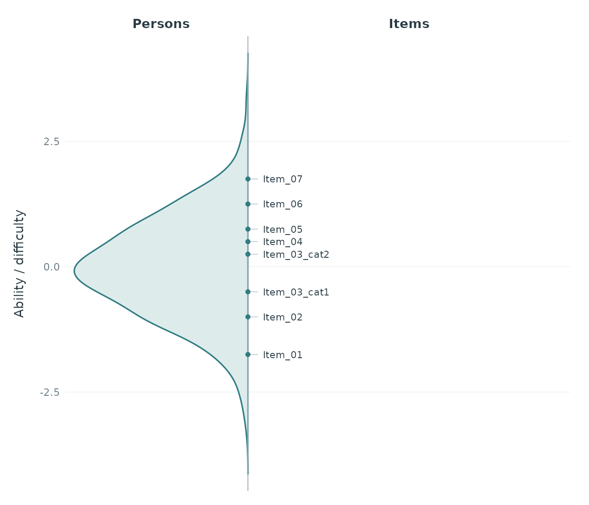
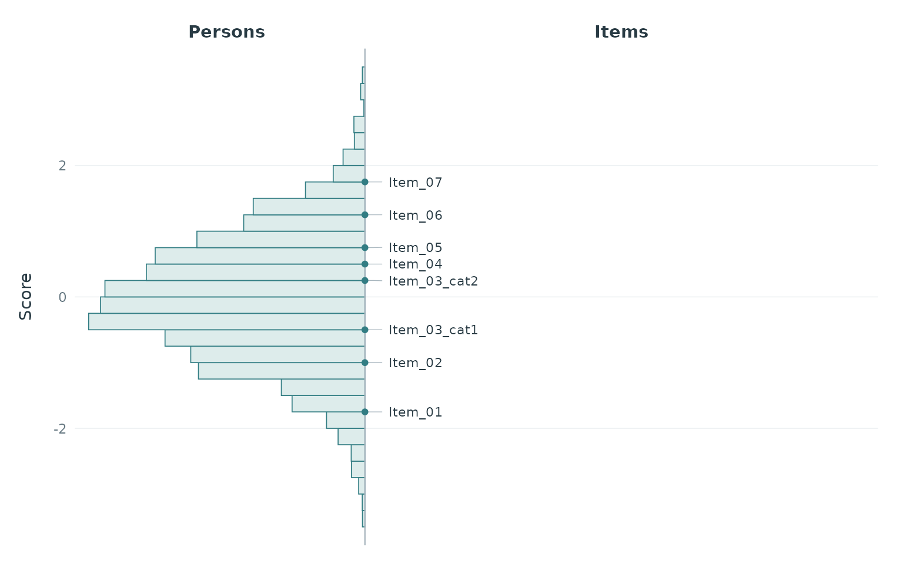
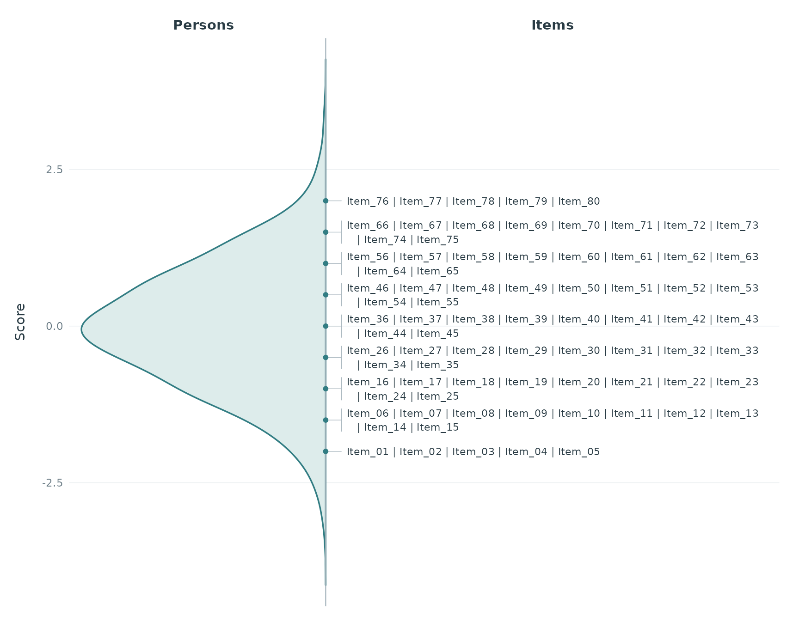

# Wright Maps

[`plotWrightMap()`](https://sachseka.github.io/eatPrep/reference/plotWrightMap.md)
places a person distribution and item names on a shared vertical metric.
Higher scores and harder items appear towards the top. A continuous line
separates the two sides; item names on the same display stage are
separated by `|`. The default uses a soft teal distribution on a white
background with subtle guides. Both portrait and landscape output are
supported.

Supply item difficulties and plausible values (PVs) that already refer
to the same dimension and metric. If identifiers repeat, the function
checks the `category` column (or the column specified by
`category_col`). Identifier and category together must be unique. Only
repeated identifiers get a suffix, such as `Item_03_cat1`; unique
identifiers keep their names, and their categories may be missing.
Already unique names are also accepted. No threshold calculation is
performed.

``` r

set.seed(42)
persons <- data.frame(
  id = 1:500,
  PV1 = rnorm(500), PV2 = rnorm(500), PV3 = rnorm(500),
  weight = runif(500, 0.5, 2)
)
items <- data.frame(
  item = c("Item_01", "Item_02", "Item_03", "Item_03",
           "Item_04", "Item_05", "Item_06", "Item_07"),
  category = c(NA, NA, 1, 2, NA, NA, NA, NA),
  difficulty = c(-1.7, -1.1, -0.4, 0.35, 0.45, 0.8, 1.2, 1.75)
)
```

The default is a density curve. Each PV contributes a separate weighted
density, evaluated on a common grid with a common bandwidth; these
curves are averaged. The function never substitutes respondent-level PV
means for the PV distribution.

``` r

p <- plotWrightMap(
  items, persons, pv_cols = paste0("PV", 1:3), weight_col = "weight",
  item_step = 0.25, score_label = "Ability / difficulty"
)
p
```



`item_step` controls display precision. Here each item is assigned to
the nearest multiple of 0.25, so its displayed position differs by at
most 0.125 from the supplied parameter. Exact halfway values are
assigned upwards. The default chooses a pretty step targeting about 30
intervals across the combined observed PV and item range.
`item_step = 0` retains exact positions. Item names retain input order
within each stage.

The original parameters and computed distribution remain available:

``` r

attr(p, "wright_data")$items
#>           item item_id category difficulty stage
#> 1      Item_01 Item_01     <NA>      -1.70 -1.75
#> 2      Item_02 Item_02     <NA>      -1.10 -1.00
#> 3 Item_03_cat1 Item_03        1      -0.40 -0.50
#> 4 Item_03_cat2 Item_03        2       0.35  0.25
#> 5      Item_04 Item_04     <NA>       0.45  0.50
#> 6      Item_05 Item_05     <NA>       0.80  0.75
#> 7      Item_06 Item_06     <NA>       1.20  1.25
#> 8      Item_07 Item_07     <NA>       1.75  1.75
head(attr(p, "wright_data")$population)
#>       score      density
#> 1 -4.136719 1.705464e-05
#> 2 -4.120286 2.073432e-05
#> 3 -4.103854 2.505762e-05
#> 4 -4.087421 3.010614e-05
#> 5 -4.070989 3.596700e-05
#> 6 -4.054556 4.280086e-05
```

An optional histogram uses common left-closed, right-open bins for all
PVs and averages weighted relative frequencies across PVs. Both
histogram and density widths are scaled to show the distribution’s
shape, rather than person counts.

``` r

plotWrightMap(
  items, persons, pv_cols = paste0("PV", 1:3), weight_col = "weight",
  person_geom = "histogram", binwidth = 0.25, item_step = 0.25
)
```



Wide and long PV tables use the same arguments as
[`plotPopulationCuts()`](https://sachseka.github.io/eatPrep/reference/plotPopulationCuts.md):

``` r

long <- tidyr::pivot_longer(
  persons, c("PV1", "PV2", "PV3"), names_to = "pv", values_to = "score"
)
plotWrightMap(
  items, long, respondent_id_col = "id", pv_id_col = "pv",
  pv_value_col = "score", weight_col = "weight"
)
```

Missing PVs are rejected by default. `pv_missing = "drop"` omits them
with a warning and renormalizes weights within each PV. At least two
observations with positive weights must remain in every PV.

Use `person_prop` to set the approximate share of width for the person
side, `item_size` for the maximum item font size, and `density_bw` or
`density_adjust` for smoothing. Long rows wrap between item names, with
a hanging indent for continuation lines and a bracket grouping the
block. Blocks can move slightly to avoid overlap; leaders connect them
to exact stage markers on the divider. Text shrinks only when all blocks
cannot fit, or a single name is too wide. With many items, increase the
output width or height, decrease `person_prop`, or adjust `item_step` to
keep text readable. `score_limits` zooms the display without changing
the estimates or stages.

``` r

crowded_items <- setNames(seq(-2, 2, length.out = 80),
                          paste0("Item_", sprintf("%02d", 1:80)))
plotWrightMap(crowded_items, persons, pv_cols = paste0("PV", 1:3),
              item_step = 0.5)
```



Colours are configurable through `person_fill`, `person_colour`,
`item_colour`, and `line_colour`. For a neutral appearance, for example:

``` r

plotWrightMap(items, persons, pv_cols = paste0("PV", 1:3),
              person_fill = "grey92", person_colour = "grey30",
              item_colour = "grey20", line_colour = "grey65")
```

The return value is a `ggplot` object. For example:

``` r

p + ggplot2::labs(title = "Wright map")
ggplot2::ggsave("wright-map.pdf", p, width = 8, height = 6)
```
